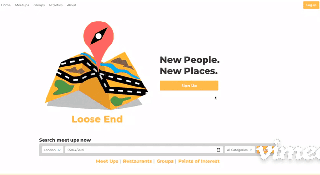
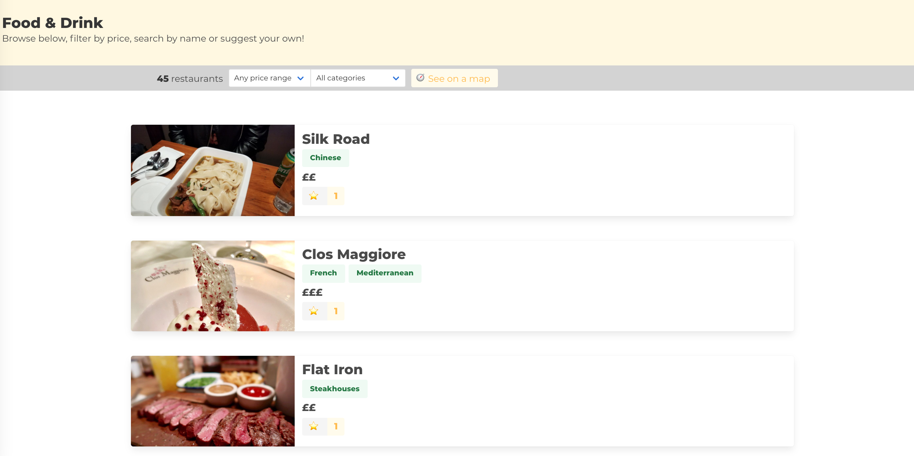
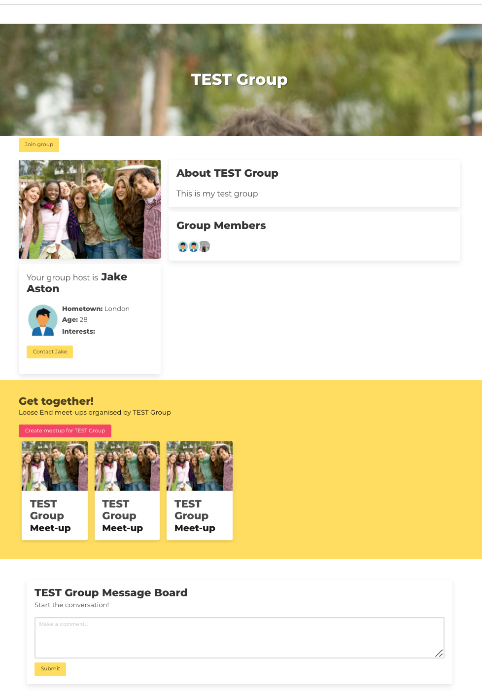
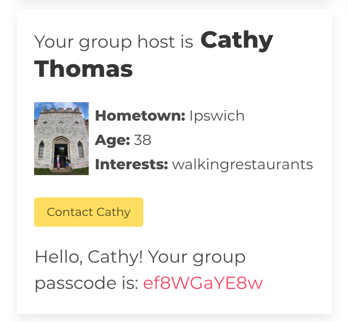
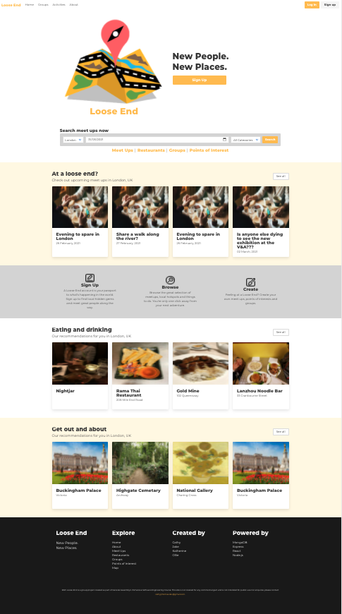

### General Assembley Software Engineering Immersive Course

# Loose End

Check out Loose End [here](https://loose-end-ga.herokuapp.com/)

## New people. New places

### The brief
* Work in a team of four, using git to code collaborative.
* Build a full-stack application in one week, by making your own backend and your own front-end.
* Use an Express API to serve your data from a Mongo database
* Consume your API with a separate front-end built with React
* Be a complete product which most likely means multiple relationships and CRUD functionality for at least a couple of models

### Technologies
* __Frontend:__
* HTML
* SCSS
* Bulma
* ReactJS
* Webpack
* __Backend:__
* Express
* MongoDB
* Mongoose

## The idea

### The problem
You find yourself in a new city a long way from home. Maybe you're there on business, maybe to attend an event, maybe you're travelling and passing through. Whatever brings you to the place, your problem is simple: you don't know anyone there and you have no idea what to do with the free time you have. 

### The solution

The above is an issue I've had more than once when travelling on business, and so I pitched to my group the idea of Loose End. Think a mash-up of Trip Advisor and Meetup. The idea is you can post meetups on the site, make suggestions for what to see and do, and invite other users to join you. A comprehensive API for restaurants and local points of interest also gives the user ideas for places to either suggest a meetup or just visit alone. 

### Our data and APIs

For restaurants we used Yelp's external Fusion RESTful API and for maps we used MapBox. For points of interest we created our own database.

## The plan

### The user journey

We started out making a list of all the functionality we wanted the site to have and came up with the user journey. Using Loose End, users should be able to:

* Set up an account
* Log in
* Search for existing meetups
* View details of existing meetups
* Create (and edit/delete) new meetups
* Comment on meetups
* Make suggestions for meetup locations
* Comment on meetups
* Search for restaurants
* Add (and edit/delete) new restaurants
* View restaurant details
* Comment on restaurants
* Add restaurants to a wishlist
* Search for points of interest
* Create (and edit/delete) new points of interest
* View point of interest details
* Comment on points of interest
* Add points of interest to a wishlist
* View restaurants on a map
* View points of interest on a map
* Create (and edit/delete) private groups
* Find and join existing groups
* Comment on groups
* Create (and edit/delete) group meetups
* View user profiles

It's a pretty big list, and we could have maybe saved ourselves quite a lot of later headaches by trimming this list down at the start! 

We split the site into four sections - meetups, restaurants, points of interest, groups and user elements (signup/login/profile etc) - and divided them between us at the back-end stage, each of us creating our own endpoints.

### Databases
This was my first experience of online databases and using a NoSQL database. Coming from an Excel background, I found the differences quite stark! We knew we were going to need a reference data between a number of sources, but some of them turned out to be pretty tough to implement. Nevertheless, a huge amount was learned through doing, and by helping each other, we were able to set up our endpoints before moving onto the front-end.

## Where I took the lead

On this project I took the lead on all the elements related to restaurants and groups. I also added fonts and developed the basic concept and color-scheme for the homepage, based off a logo we had agreed on as a group.

### Restaurants

We wanted to seed our Loose End resturant database from a 3rd party API, so we chose Yelp Fusion, which provided free access. The first thing to do was to find the necessary API endpoints to pull restaurants in London for different categories. I needed to create an array of categories - making sure they matched the categories used by the API - and then loop through them, doing a separate get request for each category. This took a lot of trial and error, but eventually I was able to fetch at least two restaurants in each category from the API. We could then use this data to seed our database.

The restaurants page itself is fairly simple, giving users the ability to search by category or price. When a user clicks on a restaurant, they are given further information pulled from Yelp, as well as an embedded location map that we pulled from the Mapbox API.

### Groups

One of the pieces of functionality that I wanted for the site was the ability for users to set up groups. For example, if a conference or wedding or some other event is taking place in the city, then the event organiser could set up a group and provide event participants with login details. They could then create private meetups within the group that aren't accessible to the public. 

On the face of it, this felt like something pretty easy to implement, but due to all the different relationships required in the back-end it turned out to be far more complicated than I anticipated! Unfortunately, I wasn't able to incorporate a lot of the functionality that I envisaged for the group feature, but there are still some parts that I'm proud of. 

One important element for groups was the ability to set a password. The code in the group page searches for a group that matches the password entered by the user. It does this by mapping through all existing groups and finding one with a password that matches:

~~~javascript
  function handleSubmit(event) {
    event.preventDefault()
    updatePasscodeSubmit(true)
    try {
      groupsData.map((group) => {
        if (group.passcode === inputValue) {
          updatePasscodeMatch(true)
          history.push(`/groups/${group._id}`)
        }
      })
    } catch (err) {
      console.log(err)
    }
  }
~~~

Of course, this means that the password has to be unique, otherwise the system could direct the user to the wrong group. A way I got around this problem was to use a React library called [Generate Password](https://www.npmjs.com/package/generate-password). Using this library, when a user creates a group, a password is automatically generated for them:

This password can then be used to access the group from the group search page and anyone provided with this password can access the group. 

Unfortunately, there are still a few bugs in the groups section and one of my big regrets for this project was that I was unable to hook up the back-end so that group members can create group meetups, but I hope to add this in future.

### Homepage

One of the things I like most about Loose End is the homepage. As a group we agreed on the logo, but the homepage layout and colour scheme was based on my mock-up. Since initial deployment I have also added a few features, such as changing the fonts and moving the meetup search bar onto the homepage and used Bulma formatting to ensure all the sections and cards are displayed neatly.

### Photo upload component

Another major component I contributed to the site was the image upload functionality. This uses Cloudify to create an separate image API in the backend. Using this API, it is then possible to update the image form data when creating new groups or restaurants, so that their uploaded image is used.

## Next time...

### Improvements
Given more time, I would certainly have gone through and made the site seem more consistent, making sure that the colours and other page elements match throughout the site. Styling for the site ended up being done in a bit of a hurry, and we were a little over-reliant on the framework for look and feel. I would also look harder at the user journey and make it simpler and more obvious how to move through the site.

The site is also not responsive and really needs to be updated to be viewable on mobile.

### Future additions
* Mobile-friendly!

* A more robust search and filter system for the restaurants and points of interest would be a good addition.

* I would also like to add some popovers to the maps to make them look a bit cleaner. 

* The ability for users to see which groups they are members of would be really useful, and, of course, the ability for groups to create their own meetups, which is pretty central!

### Bugs squished (and not-so-squished)
There aren't a huge number of bugs, but a few things left unfinished. 

On the groups page the site shows a join group button whether the user is already a member or not. Also, there is a bug in the comments, meaning that these are not currently operational on the group page.

### Key learning and wins
Creating Loose End was a HUGE learning curve with many lessons learned. It project and we maybe didn't plan as cohesively as we should. Also, the amount of functionality was extremely ambitious. With hindsight we should have made something smaller and more cohesive. Personally, I'm probably guilty of running away with an idea and letting my determination to add in all the functionality I wanted get away with me. This was one of those projects where my ambition ran slightly ahead of my capabilities at the time and I should have probably dropped the groups element in favour of concentrating solely on the (more central) restauarnts element. 

Because it was a first back-end project it took a lot of time to do simple things and we were very much learning as we went along. But I came out of this project a far better coder and it was a great set-up for project 4.
If I was to do this project with my current knowledge I'd have been able to implement a lot more and that is a win in itself!

## Assets
* Maps - [Mapbox](https://www.mapbox.com/)
* Restaurant API - [Yelp Fusion](https://www.yelp.com/fusion)
* Passwords - [Generate Password](https://www.npmjs.com/package/generate-password)
* Image uploads - [Cloudify](https://cloudify.co/)
